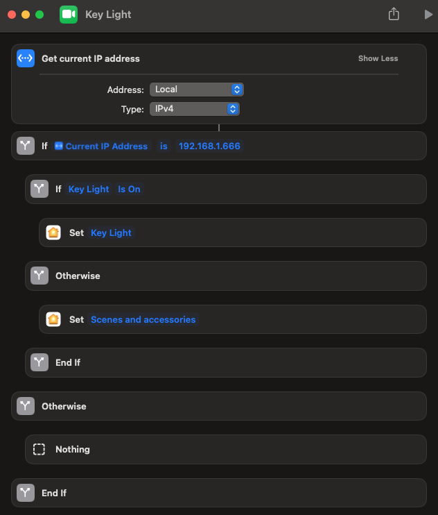

# Key Light Automation

A simple script to automate a HomeKit light turning on/off with a webcam's start/stop state in macOS. I use a Hue Play light bar set to a specific white color temperature, but this should work with any HomeKit light.

## Instructions

1. Place the `key-light-automation.sh` script in a location of your choice.
2. Create a Shortcut named "Key Light" that toggles your HomeKit light on/off with desired settings. Example Shortcut below.
3. Edit the included .plist file to point to the location of the script.
4. Place the edited .plist file in `~/Library/LaunchAgents/`.
5. Run `launchctl load ~/Library/LaunchAgents/com.key-light-automation.plist` in your shell to load the script. It will be loaded in subsequent reboots.

### Example Shortcut

## Credit

- [Edward Anderson](https://apple.stackexchange.com/a/434652/504387)
- [alloy](https://apple.stackexchange.com/questions/424789/can-i-trigger-a-homekit-scene-when-my-laptops-camera-is-turned-on-or-off#comment658118_434652)
